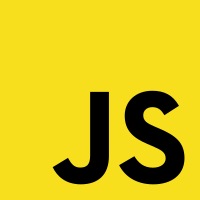

# GSwap 🌠

### Create a gallery of images with ease.


<h3 style="text-align:center;text-decoration:underline">
  Working:
</h3>
<div style="display:flex; gap:1rem; justify-content:center">
  

  

</div>

---

To get started, in your project folder, run:

```bash
npm i @dpouris/gswap
```

# Usage 🔨

First, import the library and create a new gswap instance:

```js
import GSwap from '@dpouris/gswap';

...

const galleryContainer = document.getElementById("gallery")

const gswap = new GSwap({
  containerElem: galleryContainer // or pass the id "gallery",

  images: ["./1.jpg", "./2.jpg", "./3.webp"],

  options : {
    //animation: "fade", -> Todo
    animationDuration: "300",
    navigation: true,
    // repeat: true, -> Todo
    imgDimensions: { height: 300, width: 300 },
  }
});
```

This will create a new instance of gswap and will place the gallery absolutely inside the container you specified.

- **containerElem** (_required_):
  - The container (div) element where the gallery will be placed absolutely or a string value representing the id of an existing div in the document. If none is found the div will be created and be appended at the end of the body.
- **images** (_required_):
  - An array of image paths or urls.
- **options** (_optional_):
  - An object of options.
  - See the [options](#Options) section for more details.

# Options ⚙️

## **animation** (_fade_ | _slide_ | _none_) -> [wip]

    Takes in an animation eg. fade or slide and applies it to the switching motion of the images.

- **fade**:
  Fades the images in and out.
- **slide**:
  Slides the images in and out.
- **none**:
  Does not apply any animation.

- **Default**: fade

---

## **animationDuration** (_number_)

    Takes in the duration of the animation that occurs upon switching the images and the speed at which the images move, in milliseconds. # 1000 = 1 second.

- **Default**: 300

---

## **navigation** (_boolean_ | forwardOnly | backOnly)

    If true, the navigation arrows will be displayed. # true | false | "forwardOnly" | "backOnly"

- **forwardOnly**:
  Only the forward arrow will be displayed.
- **backOnly**:
  Only the back arrow will be displayed.

- **Default**: true

---

## **repeat** (_boolean_)

    If true, the gallery will loop infinitely. # true || false

- **Default**: true

## direction (_top_ | _bottom_ | _left_ | _right_)

    The direction of the gallery. # top || bottom

## styled (_boolean_)

    If true the images will have a nice box shadow and slightly rounded corners. # true || false

## imgDimensions (_object_ : {height : number, width: number})

    Takes in an object that contains the keys of width and height that will be applied as the dimensions of the images. # { height: 300, width: 300 }

    Default: { height: 300, width: 300 }

# Methods 🧑‍💻

- [**gswap.next()**](<#gswap.next()>)
- [**gswap.prev()**](<#gswap.next()>)
- [**gswap.goTo(index)**](<#gswap.goTo(index)>) -> [wip]
- [**gswap.stackImages()**](<#gswap.stackImages()>)

---

## **gswap.next()**

Displays the next image in the gallery.
You can call the **next()** method by calling it from the gallery instance like so.

```js
const gallery = new GSwap(...);

...

gallery.next();
```

OR

You can bind the **next()** method to an onclick event like so.

```js
const gallery = new GSwap(...);
const nextBtn = document.getElementById('nextGalleryBtn')

nextBtn.onclick = gallery.next;
```

**The same concept applies for the .prev() method the only difference being the it moves backwards through the images.**

## **gswap.goTo(index)** -> wip

Takes in an index and displays the image at that index.

[wip]

## **gswap.stackImages()**

Stacks the images in the gallery in case their position was altered.

Can be called from the gallery instance like so.

```js
const gallery = new GSwap(...);

...

gallery.stackImages();
```

# TypeScript 🥰

You can find the types on `@dpouris/gswap/dist/types`:

```js
import { GallerySwap, Options } from "@dpouris/gswap/dist/types";
```

## GallerySwap

```js
// GSwap
interface GallerySwap {
  containerElem: HTMLDivElement;
  images: string[];
  options: Options;
  stackImages(): void;
  stackImages: () => void;
  next: () => void;
  prev: () => void;
  goTo: (index: number) => void;
}

// Options
type Options = {
  animation?: string,
  animationDuration?: number,
  navigation?: boolean | "forwardOnly" | "backOnly",
  repeat?: boolean,
  direction?: "left" | "right" | "top" | "bottom",
  styled?: boolean,
  imgDimensions?: {
    height: number,
    width: number,
  },
};
```

# React Example 😎

```js
import GSwap from "@dpouris/gswap";
import { GallerySwap } from "@dpouris/gswap/dist/types";
import { useEffect, useRef } from "react";

const Gallery = () => {
  const gallery = useRef<GallerySwap>();

  useEffect(() => {
    if (!document) return;

    const galleryOptions = {
      imgDimensions: { height: 500, width: 600 },
      styled: true,
      repeat: true,
    };

    const imageUrls = [
      "...lqdieniMabM2rLBDJl6XhTwb0=",
      "...softw-office-140335451.jpg",
      "...image-164232735.jpg",
    ];

    gallery.current = new GSwap("gallery", imageUrls, galleryOptions);

  }, [])

  return (
    <div className="flex flex-col items-center justify-center gap-3 my-4">
      <h1 className="text-3xl font-medium text-slate-700 mb-4 border-y-2 border-emerald-400 rounded-lg py-4 px-3 ">
        EVENT GALLERY
      </h1>
      <div id="gallery" className="mx-auto"></div>
      <button
        onClick={() => {
          gallery.current!.goTo(2);
        }}
      >
        GOTO 3RD IMAGE
      </button>
    </div>
  );
};

export default Gallery;

```

The result is the gif at the start of the README.

- The above example is implemented in Next.js hence the checking for document in the useEffect.

## Thank you for trying out my first library and I hope you enjoy it. 🫡
